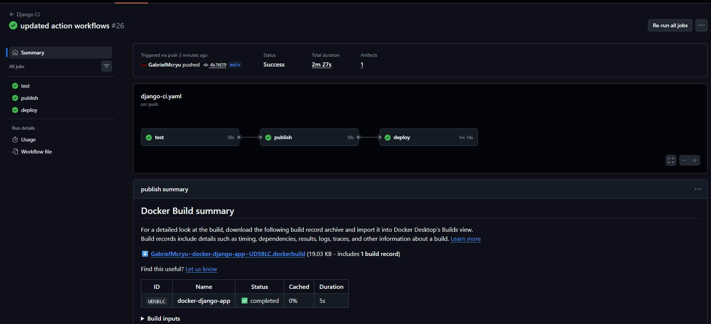
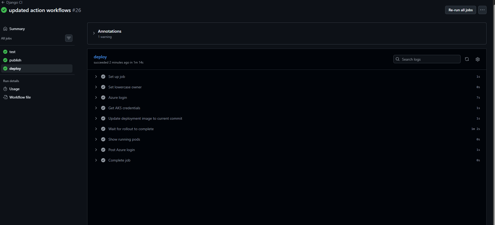
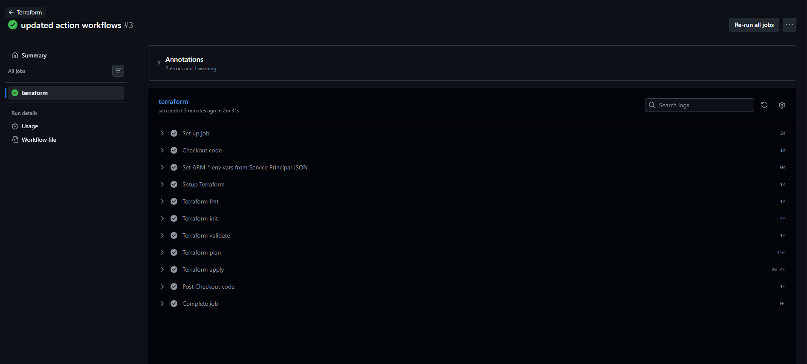

# Django Redis Postgres App

A Django REST Framework backend application with PostgreSQL as the database and Redis for caching, fully dockerized and tested with GitHub Actions CI.

## Tech Stack

- **Django** + **Django REST Framework** — backend and API
- **PostgreSQL 16** — relational database
- **Redis** — caching layer
- **Docker** + **Docker Compose** — containerization
- **GitHub Actions** — CI/CD pipeline
- **GitHub Container Registry (GHCR)** — container image registry

## API Endpoints

| Method | Endpoint | Description |
|---|---|---|
| `GET` | `/health/` | Health check — returns `{"status": "ok"}` for liveness/readiness probes |
| `POST` | `/api/books/` | Create a new book |
| `GET` | `/api/books/` | Retrieve all books |
| `GET` | `/api/redis-test/` | Check Redis connection status |

## Project Structure
```
├── books/
│   ├── models.py            # Book model
│   ├── serializers.py       # DRF serializers
│   ├── views.py             # API views
│   └── urls.py              # App URLs
├── django_redis_postgres_app/
│   ├── settings.py          # Django settings (env-driven)
│   ├── urls.py              # Project-level URLs (incl. /health/)
│   └── wsgi.py / asgi.py
├── .github/
│   └── workflows/
│       ├── django-ci.yaml   # Application CI/CD (test, publish image, deploy)
│       └── terraform.yaml   # Infrastructure CI/CD (plan on PR, apply on push)
├── modules/                 # Terraform modules (aks, kubernetes-app)
├── main.tf                  # Root Terraform config
├── variables.tf
├── outputs.tf
├── terraform.tfvars.example # Template (committed); copy to terraform.tfvars
├── Dockerfile
├── docker-compose.yaml
└── manage.py
```

## Docker Setup

The application runs in 3 containers connected via a shared `app-network`:

- **django-app** — Django application server
- **db** — PostgreSQL 16 database
- **cache** — Redis cache

### Running the project

1. Clone the repository:
```bash
git clone git@github.com:username/your-repo.git
cd your-repo
```

2. Create your `.env` file:
```bash
cp .env.example .env
```

3. Update `.env` with your values:
```bash
DB_NAME=your_db_name
DB_USER=your_db_user
DB_PASSWORD=your_db_password
DB_HOST=db
DB_PORT=5432
REDIS_URL=redis://cache:6379/1
SECRET_KEY=your_secret_key
DEBUG=True
```

4. Build and start the containers:
```bash
docker compose up --build -d
```

The app will be available at `http://localhost:8000`

### Stopping the project
```bash
docker compose down
```

## Container Registry

The Docker image is published to GitHub Container Registry (GHCR) and is updated on every push to `main`.

### Pull the image
```bash
docker pull ghcr.io/gabrielmcryu/django-app:latest
```

### Run directly from the registry
```bash
docker pull ghcr.io/gabrielmcryu/django-app:latest
```

Images are tagged with both `latest` and the commit SHA for traceability:
- `ghcr.io/gabrielmcryu/django-app:latest` — most recent build
- `ghcr.io/gabrielmcryu/django-app:<commit-sha>` — specific commit build

## Application CI/CD (`django-ci.yaml`)

The application workflow runs on every push to `main` and has three jobs that run in sequence:

**Test job:**
1. Creates the `.env` file from GitHub Secrets
2. Builds and starts all Docker containers
3. Waits for services to be ready
4. Tests all 4 endpoints (`/health/`, `/api/redis-test/`, `POST /api/books/`, `GET /api/books/`)
5. Tears down the containers

**Publish job** (runs only if tests pass):
1. Logs in to GitHub Container Registry
2. Builds the Docker image
3. Pushes the image tagged with `latest` and the commit SHA to GHCR

**Deploy job** (runs only if publish succeeds):
1. Logs in to Azure with the Service Principal stored in `AZURE_CREDENTIALS`
2. Fetches admin credentials for the AKS cluster (`az aks get-credentials --admin`)
3. Updates the deployment image to `ghcr.io/<owner>/django-app:<commit-sha>` via `kubectl set image`, which triggers a rolling restart
4. Waits for the rollout to complete and lists the running pods

The deploy job pins each release to the commit SHA rather than `:latest`, so every rollout is traceable to an exact build. Kubernetes detects the image change and performs the rolling restart automatically — no `kubectl rollout restart` needed.

A full successful run showing test → publish → deploy:



The deploy job in detail:



## Infrastructure CI/CD (`terraform.yaml`)

The infrastructure workflow runs only when Terraform code changes (path filter: `**.tf`, `modules/**`, `.github/workflows/terraform.yaml`). Behavior depends on the trigger:

| Trigger | Steps run | Effect |
|---|---|---|
| **Pull request** to `main` | `fmt → init → validate → plan` | Reviewer reads the proposed infrastructure changes in the job log |
| **Push** to `main` | the same steps plus `apply -auto-approve` | The plan is generated and immediately applied to Azure |

The workflow authenticates to Azure with a Service Principal scoped to **subscription Contributor** (separate from the AKS-only SP used by the application deploy job). Its credentials JSON is stored as the `AZURE_CREDENTIALS_TF` secret; the workflow parses it inline into the four `ARM_*` env vars Terraform expects.

A successful run showing the workflow steps:



### Why two workflows, not one?

`terraform.yaml` owns the **shape** of the infrastructure (cluster, databases, deployment manifest, service). `django-ci.yaml` owns the **content** of running pods (image tag rollouts). Splitting them means an app push doesn't trigger an unnecessary `terraform plan` and an infra change doesn't accidentally rebuild the Docker image. The two pipelines run independently and reconcile cleanly because the deployment's `image` field is excluded from Terraform's drift detection (see [modules/kubernetes-app/main.tf](modules/kubernetes-app/main.tf)).

## Secrets and Sensitive Variables

All sensitive values are stored in **GitHub Secrets** (Settings → Secrets and variables → Actions) and consumed by the workflows via `${{ secrets.<NAME> }}`. GitHub masks them in workflow logs and never exposes them to the filesystem in plaintext.

### Secrets used by `django-ci.yaml`

| Secret | Purpose |
|---|---|
| `DB_NAME`, `DB_USER`, `DB_PASSWORD`, `DB_HOST`, `DB_PORT` | populate `.env` for the docker-compose stack used in the test job |
| `REDIS_HOST`, `REDIS_PORT` | same — Redis connection for the test job |
| `SECRET_KEY`, `DEBUG` | Django settings for the test job |
| `AZURE_CREDENTIALS` | Service Principal JSON, scoped to `Azure Kubernetes Service Cluster Admin Role` on the AKS cluster — used by the deploy job |

### Secrets used by `terraform.yaml`

| Secret | Purpose |
|---|---|
| `AZURE_CREDENTIALS_TF` | Service Principal JSON with `Contributor` on the subscription. Parsed in-flight into `ARM_CLIENT_ID`, `ARM_CLIENT_SECRET`, `ARM_TENANT_ID`, `ARM_SUBSCRIPTION_ID` |
| `TF_VAR_DB_ADMIN_PASSWORD` | Postgres admin password for the Flexible Server |
| `TF_VAR_DJANGO_SECRET_KEY` | Django `SECRET_KEY` for the deployed pod (stored as a K8s Secret) |
| `TF_VAR_GHCR_TOKEN` | GitHub PAT (`read:packages` only) used as the K8s image-pull secret |

### Why two Service Principals?

Least privilege. The deploy job only needs to fetch AKS credentials and run `kubectl`, so it gets a narrow role scoped to the cluster. The Terraform workflow needs to manage every Azure resource in the project (RG, VNet, Postgres, Redis, AKS itself), so it gets subscription-wide `Contributor`. A leaked deploy-job credential cannot drop your database or VNet.

### Inside the cluster

Application secrets (`DB_PASSWORD`, `SECRET_KEY`, `REDIS_PASSWORD`) are stored as a Kubernetes `Secret` resource and surfaced to the pod via `secret_key_ref` env vars. Terraform creates this Secret from the `TF_VAR_*` values during apply.

For production, these would typically migrate to **Azure Key Vault** with the [Secrets Store CSI Driver](https://learn.microsoft.com/en-us/azure/aks/csi-secrets-store-driver) — pods mount secrets as files synced from Key Vault, so values never live in K8s state. That's a future improvement; for this project, plain Kubernetes Secrets are sufficient.

## Azure Deployment (AKS)

The application is deployed to Azure Kubernetes Service (AKS) via Terraform, with managed Azure Postgres and Redis backing it.

### Architecture

- **AKS cluster** — 2 nodes (`Standard_B2s`), Azure CNI networking
- **Azure Database for PostgreSQL Flexible Server** — private, in a delegated subnet
- **Azure Cache for Redis** — Basic tier
- **VNet + private DNS** — pods reach Postgres via private endpoint
- **LoadBalancer Service** — public IP exposing the Django app on port 80

All resource groups created for the project:


The `django-aks-rg` resource group holds everything declared in Terraform (AKS, Postgres, Redis, VNet, NSG, DNS):


The `MC_django-aks-rg_django-aks-aks_eastus2` resource group is auto-created and managed by AKS. It contains the underlying VMs, public IP, and LoadBalancer:


### Terraform Structure

```
├── main.tf                   # Providers, networking, Postgres, Redis, module calls
├── variables.tf              # Input variables (region, sizing, image, secrets)
├── outputs.tf                # Cluster FQDN, LoadBalancer IP, etc.
├── terraform.tfvars.example  # Template documenting required + optional inputs
├── terraform.tfvars          # Project-specific overrides (gitignored)
└── modules/
    ├── aks/                  # AKS cluster
    └── kubernetes-app/       # Namespace, secrets, deployment, service
```

### Deployment

1. Bootstrap the state backend (one-time):
```bash
az group create -n devops-tf-rg -l eastus
az storage account create -n <unique-name> -g devops-tf-rg -l eastus --sku Standard_LRS
az storage container create -n tfstate --account-name <unique-name>
```

The storage account holds the Terraform state file, isolated from the project's resource group:


2. Update the backend block in `main.tf` with the storage account name.

3. Create your `terraform.tfvars` from the example and fill in `ghcr_username` and `container_image`:
```bash
cp terraform.tfvars.example terraform.tfvars
```

4. Set sensitive variables via environment (kept out of the tfvars file):
```bash
export TF_VAR_db_admin_password='<strong-password>'
export TF_VAR_django_secret_key='<random-secret-key>'
export TF_VAR_ghcr_token='<github-pat-with-read:packages>'
```

5. Apply (two-phase, due to the kubernetes provider depending on AKS outputs that don't exist yet):

```bash
terraform init

# Phase 1 — create AKS first so the kubernetes provider has credentials to use
terraform apply -target=module.aks

# Phase 2 — create everything else (Postgres, Redis, K8s namespace, deployment, service)
terraform apply
```

The `-target` flag automatically pulls in all transitive dependencies of `module.aks` (resource group, VNet, AKS subnet, NSG association). Once phase 1 succeeds, `module.aks` outputs are known and the kubernetes provider can be configured normally — phase 2 plans without errors.

> Note: `-target` is generally discouraged for routine ops, but it's the canonical workaround for this specific bootstrap chicken-and-egg. You only need it for the very first apply against a fresh state. Subsequent applies — including those run by `terraform.yaml` in CI — work without `-target`.

The `app_load_balancer_ip` output gives the public IP. Hit `/health/`, `/api/redis-test/`, and `/api/books/` to verify.

### Pushing the application image

The Terraform deployment references `ghcr.io/<owner>/django-app:latest`, which is built and published by the `django-ci.yaml` workflow on every push to `main`. If you're bootstrapping for the first time and the image doesn't exist yet, push your code once before running `terraform apply` so the K8s pods have something to pull.

For ad-hoc local builds:

```bash
docker build -t ghcr.io/<owner>/django-app:latest .
echo "$GHCR_TOKEN" | docker login ghcr.io -u "$GHCR_USERNAME" --password-stdin
docker push ghcr.io/<owner>/django-app:latest
```

### Verification

Health endpoint — confirms Django is up and probes are passing:


Redis endpoint — confirms the pods can reach Azure Cache for Redis:


Books endpoint — confirms the pods can reach Azure Postgres via the private DNS:


### Known Terraform Issues & Fixes

| Issue | Fix |
|---|---|
| `LocationIsOfferRestricted` when creating Postgres in `eastus` | Subscription restriction — switch region in `terraform.tfvars`: `location = "eastus2"` |
| `Invalid provider configuration depends on values that cannot be determined until apply` (kubernetes provider) | The kubernetes provider needs the AKS cluster outputs, which don't exist until AKS is created. Use `terraform apply -target=module.aks` for the bootstrap apply, then `terraform apply` for everything else. No code edits required (older versions of the README suggested commenting out the kubernetes provider — `-target` is cleaner). |
| `Authenticating using the Azure CLI is only supported as a User (not a Service Principal)` (in CI) | The `azurerm` provider can't use `azure/login`'s CLI session when authenticating as a Service Principal. The `terraform.yaml` workflow parses the SP credential JSON into `ARM_CLIENT_ID`, `ARM_CLIENT_SECRET`, `ARM_TENANT_ID`, `ARM_SUBSCRIPTION_ID` env vars instead — see the workflow file for the parsing step. |
| `Invalid dynamic for_each value` on `var.secret_env_vars` | Newer Terraform versions disallow iterating sensitive values in `for_each`. Use `nonsensitive(toset(keys(var.secret_env_vars)))` to expose only the keys (env var names) — the values stay sensitive and reach the pod via `secret_key_ref`. |
| `AuthorizationFailed` on `listClusterUserCredential/action` (CI deploy job) | The deploy SP has `Cluster Admin Role`, which grants `listClusterAdminCredential` — a different action. Add `--admin` to `az aks get-credentials` so the command requests the matching admin credential. |
| `OIDCIssuerFeatureCannotBeDisabled` on AKS update | Azure auto-enables OIDC but won't let it be disabled. Add `oidc_issuer_enabled = true` to the `azurerm_kubernetes_cluster` resource |
| `A resource with the ID ... already exists` after a failed apply | Phantom resources from a previous half-completed run. Import into state: `terraform import <address> <azure-resource-id>` |
| `Provider produced inconsistent result after apply` | Transient Azure API consistency issue — resources usually exist despite the error. Re-run `terraform plan` to reconcile, then `terraform apply` |

### Cleanup

```bash
terraform destroy
```

Destroys all AKS, database, and networking resources. The auto-created `MC_<rg>_<aks>_<region>` resource group (managed by AKS) is removed automatically when the cluster is destroyed. The bootstrap `devops-tf-rg` holding the Terraform state is left intact for reuse.