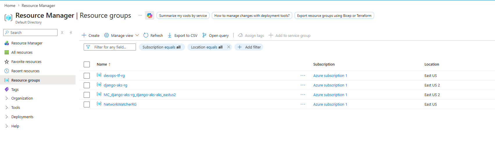
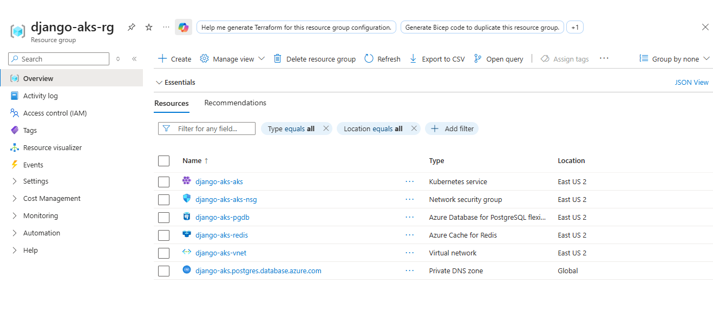
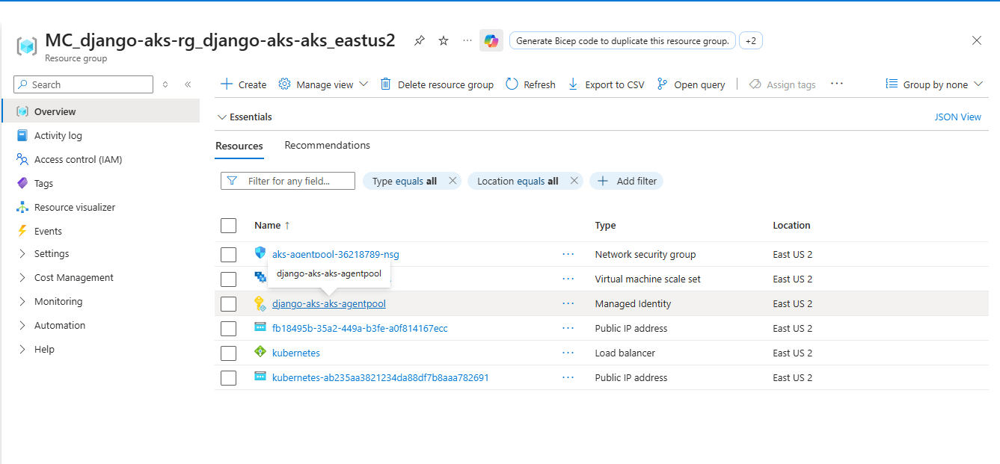
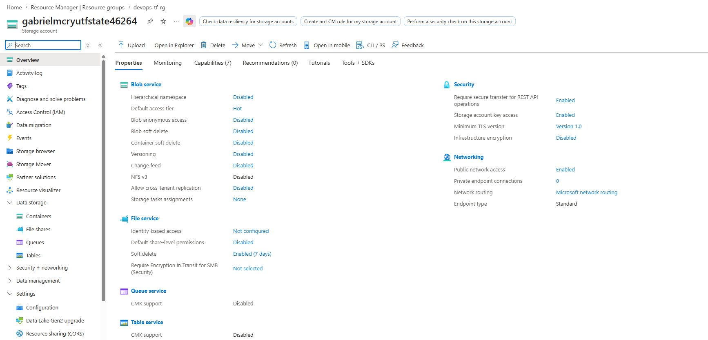
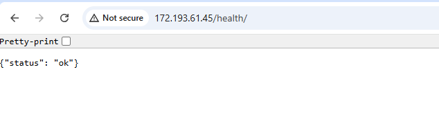
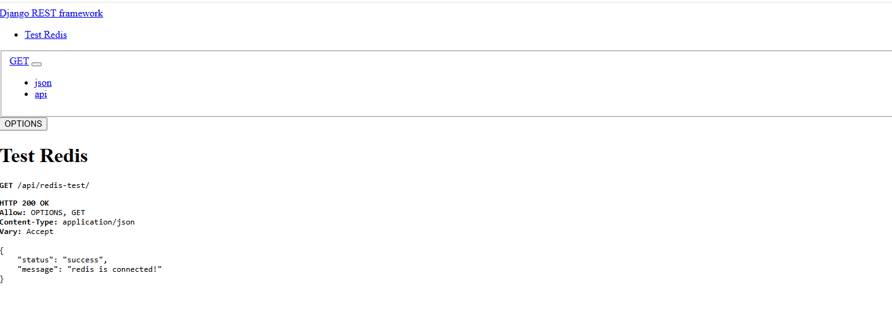
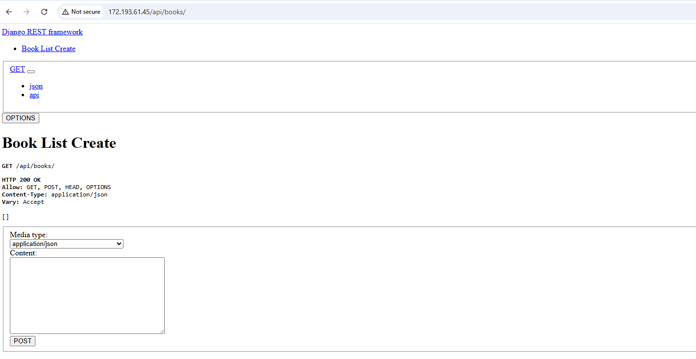

# Django Redis Postgres App

A Django REST Framework backend application with PostgreSQL as the database and Redis for caching, fully dockerized and tested with GitHub Actions CI.

## Tech Stack

- **Django** + **Django REST Framework** — backend and API
- **PostgreSQL 16** — relational database
- **Redis** — caching layer
- **Docker** + **Docker Compose** — containerization
- **GitHub Actions** — CI/CD pipeline
- **GitHub Container Registry (GHCR)** — container image registry

## API Endpoints

| Method | Endpoint | Description |
|---|---|---|
| `GET` | `/health/` | Health check — returns `{"status": "ok"}` for liveness/readiness probes |
| `POST` | `/api/books/` | Create a new book |
| `GET` | `/api/books/` | Retrieve all books |
| `GET` | `/api/redis-test/` | Check Redis connection status |

## Project Structure
```
├── books/
│   ├── models.py        # Book model
│   ├── serializers.py   # DRF serializers
│   ├── views.py         # API views
│   └── urls.py          # App URLs
├── .github/
│   └── workflows/
│       └── ci.yml       # GitHub Actions workflow
├── Dockerfile
├── docker-compose.yml
├── .env.example
└── manage.py
```

## Docker Setup

The application runs in 3 containers connected via a shared `app-network`:

- **django-app** — Django application server
- **db** — PostgreSQL 16 database
- **cache** — Redis cache

### Running the project

1. Clone the repository:
```bash
git clone git@github.com:username/your-repo.git
cd your-repo
```

2. Create your `.env` file:
```bash
cp .env.example .env
```

3. Update `.env` with your values:
```bash
DB_NAME=your_db_name
DB_USER=your_db_user
DB_PASSWORD=your_db_password
DB_HOST=db
DB_PORT=5432
REDIS_URL=redis://cache:6379/1
SECRET_KEY=your_secret_key
DEBUG=True
```

4. Build and start the containers:
```bash
docker compose up --build -d
```

The app will be available at `http://localhost:8000`

### Stopping the project
```bash
docker compose down
```

## Container Registry

The Docker image is published to GitHub Container Registry (GHCR) and is updated on every push to `main`.

### Pull the image
```bash
docker pull ghcr.io/gabrielmcryu/django-app:latest
```

### Run directly from the registry
```bash
docker pull ghcr.io/gabrielmcryu/django-app:latest
```

Images are tagged with both `latest` and the commit SHA for traceability:
- `ghcr.io/gabrielmcryu/django-app:latest` — most recent build
- `ghcr.io/gabrielmcryu/django-app:<commit-sha>` — specific commit build

## CI/CD

The GitHub Actions workflow runs on every push to `main` and:

**Test job:**
1. Creates the `.env` file from GitHub Secrets
2. Builds and starts all Docker containers
3. Waits for services to be ready
4. Tests all 4 endpoints (`/health/`, `/api/redis-test/`, `POST /api/books/`, `GET /api/books/`)
5. Tears down the containers

**Publish job** (runs only if tests pass):
1. Logs in to GitHub Container Registry
2. Builds the Docker image
3. Pushes the image tagged with `latest` and the commit SHA to GHCR

## Azure Deployment (AKS)

The application is deployed to Azure Kubernetes Service (AKS) via Terraform, with managed Azure Postgres and Redis backing it.

### Architecture

- **AKS cluster** — 2 nodes (`Standard_B2s`), Azure CNI networking
- **Azure Database for PostgreSQL Flexible Server** — private, in a delegated subnet
- **Azure Cache for Redis** — Basic tier
- **VNet + private DNS** — pods reach Postgres via private endpoint
- **LoadBalancer Service** — public IP exposing the Django app on port 80

All resource groups created for the project:



The `django-aks-rg` resource group holds everything declared in Terraform (AKS, Postgres, Redis, VNet, NSG, DNS):



The `MC_django-aks-rg_django-aks-aks_eastus2` resource group is auto-created and managed by AKS. It contains the underlying VMs, public IP, and LoadBalancer:



### Terraform Structure

```
├── main.tf                  # Providers, networking, Postgres, Redis, module calls
├── variables.tf             # Input variables (region, sizing, image, secrets)
├── outputs.tf               # Cluster FQDN, LoadBalancer IP, etc.
├── terraform.tfvars         # Project-specific overrides (gitignored)
└── modules/
    ├── aks/                 # AKS cluster
    └── kubernetes-app/      # Namespace, secrets, deployment, service
```

### Deployment

1. Bootstrap the state backend (one-time):
```bash
az group create -n devops-tf-rg -l eastus
az storage account create -n <unique-name> -g devops-tf-rg -l eastus --sku Standard_LRS
az storage container create -n tfstate --account-name <unique-name>
```

The storage account holds the Terraform state file, isolated from the project's resource group:



2. Update the backend block in `main.tf` with the storage account name.

3. Set sensitive variables:
```bash
export TF_VAR_db_admin_password='<strong-password>'
export TF_VAR_django_secret_key='<random-secret-key>'
export TF_VAR_ghcr_token='<github-pat-with-read:packages>'
```

4. Apply:
```bash
terraform init
terraform plan -out=tfplan
terraform apply tfplan
```

The `app_load_balancer_ip` output gives the public IP. Hit `/health/`, `/api/redis-test/`, and `/api/books/` to verify.

### Verification

Health endpoint — confirms Django is up and probes are passing:



Redis endpoint — confirms the pods can reach Azure Cache for Redis:



Books endpoint — confirms the pods can reach Azure Postgres via the private DNS:



### Known Terraform Issues & Fixes

| Issue | Fix |
|---|---|
| `LocationIsOfferRestricted` when creating Postgres in `eastus` | Subscription restriction — switch region in `terraform.tfvars`: `location = "eastus2"` |
| `Invalid provider configuration depends on values that cannot be determined until apply` (kubernetes provider) | Chicken-and-egg with AKS. Two-phase apply: temporarily comment out the `kubernetes` provider and `module "kubernetes_app"` block, apply to create AKS, then uncomment and apply again |
| `OIDCIssuerFeatureCannotBeDisabled` on AKS update | Azure auto-enables OIDC but won't let it be disabled. Add `oidc_issuer_enabled = true` to the `azurerm_kubernetes_cluster` resource |
| `A resource with the ID ... already exists` after a failed apply | Phantom resources from a previous half-completed run. Import into state: `terraform import <address> <azure-resource-id>` |
| `Provider produced inconsistent result after apply` | Transient Azure API consistency issue — resources usually exist despite the error. Re-run `terraform plan` to reconcile, then `terraform apply` |

### Cleanup

```bash
terraform destroy
```

Destroys all AKS, database, and networking resources. The auto-created `MC_<rg>_<aks>_<region>` resource group (managed by AKS) is removed automatically when the cluster is destroyed. The bootstrap `devops-tf-rg` holding the Terraform state is left intact for reuse.